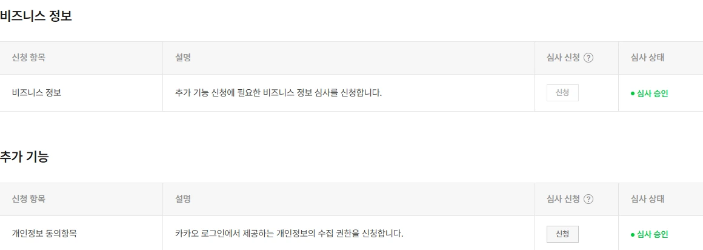

# 0902 업무 공유 — SNS 연동 확장 · 콘텐츠광장

작성일: 2026-09-02 · 대상: 개발 전달 및 팀 공유

---

## 1. 요약

- **인스타그램 연동을 실제 제약에 맞게 넓혔습니다.** 연결 상태·연결 실패·올릴 내용·올린 결과가 화면에 생겼습니다.
- **「콘텐츠광장」(임시 이름)을 새로 만들었습니다.** 사장님들이 만든 카드뉴스와 영상이 공개되는 공간입니다.
- **내 카드뉴스·내 영상의 조작을 팝업 한 자리로 모았습니다.** 목록 카드에는 그림만 남습니다.
- **카카오 개발자센터 심사가 승인됐습니다.** 비즈니스 정보와 개인정보 동의항목 모두 통과했습니다.

## 2. 바뀐 화면

v2 화면은 그대로 두고 **파일 이름에 3을 붙여 복제**했습니다. 비교해 보실 수 있습니다.

| 화면 | 파일 | 무엇이 달라졌나 |
| --- | --- | --- |
| 마이페이지 · SNS 계정 관리 | `mypage3.html` | 연동의 **본체**. 연결·해제는 여기서만 일어납니다. 프로필 사진·아이디·비즈니스 여부·연결일·남은 기간이 붙고, 만료 임박·만료됨 상태가 생겼습니다 |
| 카드뉴스 완료 | `cardnews2-done3.html` | 아래에 **SNS 연결 섹션**과 **콘텐츠광장 공개 스위치** 신설 |
| 영상 완료 | `video-wizard-result3.html` | 같은 구성 (카드 장수 처리만 없습니다) |
| 내 카드뉴스 | `cardnews2-my3.html` | 카드 위 버튼을 걷어내고 **항목 팝업**으로 모았습니다. 올린 결과가 카드에 남고 「업로드됨」 분류가 생겼습니다 |
| 내 영상 | `video-my-wizard3.html` | 같은 구성입니다 |
| 콘텐츠광장 | `gallery.html` | **신규** |

## 3. 완성 화면(카드뉴스·영상)이 이렇게 바뀌었습니다

만든 직후가 올릴지 정하는 시점이라, 완성 화면은 **마이페이지로 보내지 않고 그 자리에서 연동**합니다.

화면 아래쪽에 **두 줄**이 생겼습니다. 위가 공개, 아래가 SNS 입니다.

**① 「콘텐츠광장에 공개」 스위치** — 테두리 없는 한 줄

- **켤 때·끌 때 각각 한 번 물어봅니다.** 끌 때는 바로 껐었는데, 내려간 뒤 좋아요가
  어떻게 되는지 알 수 없어 되돌릴 수 없다고 느낍니다. 취소 시트에서 **「만든 것은 내 목록에
  그대로 남습니다」**를 먼저 말해 겁을 주지 않습니다
- **SNS 연결과 상관없이 켤 수 있습니다.** 처음에는 SNS 연결 카드 안에 넣었는데,
  그러면 「연결해야 공개된다」로 읽혀서 카드 밖·위로 뺐습니다.
  콘텐츠광장은 상인월드 **안**에 전시하는 일이고, SNS 올리기는 **밖**으로 나가는 일입니다

**② 「SNS 연결」 섹션** — 화면 맨 아래

- 인스타그램이 한 줄로 놓이고 오른쪽에 상태 배지와 버튼이 붙습니다
- **연동하기 → 연동 중 → 올리기** 로 버튼이 바뀝니다
- 연동하기를 누르면 **「계정 연결 전에 알려드립니다」 안내**가 먼저 뜹니다 — 암호화하여 보관 / 게시글 업로드에만 사용 / 연결 해제 시 영구 삭제
- 연결되면 마이페이지와 **같은 계정 카드**가 그 자리에 나옵니다 — 프로필 사진 · `@아이디` · 비즈니스 계정 · 연결일 · 남은 기간
- 연결 실패 2종(개인 계정 · 권한 거부)과 만료 임박·만료됨도 이 화면에서 그대로 보입니다
- 올리기를 누르면 **캡션·해시태그·계정·카드 장수**를 정하는 시트가 뜨고, 올린 뒤에는 결과가 네 상태로 남습니다

## 4. SNS 연동에서 채운 것

이전 시안은 「연결하기」와 「올리기」뿐이었습니다. 실제로는 아래가 상시 일어납니다.

| 제약 | 화면에 넣은 것 |
| --- | --- |
| 연결이 **60일마다 만료**됩니다 | 연결됨 · **만료 임박**(7일 이내) · **만료됨** 세 상태. 임박·만료일 때만 「다시 연결」이 나옵니다 |
| **개인 계정은 연동이 막혀 있습니다** | 실패 사유 2종과 해결 단계 — 프로페셔널 전환 / 권한 다시 허용 |
| 캡션 **2,200자** · 해시태그 **30개** | 올리기 시트에서 세면서 적습니다. 넘으면 올리기가 잠깁니다 |
| 한 게시물에 **카드 10장**까지 | 10장을 넘을 때만 물어봅니다 — 앞 10장 / 직접 고르기 / 두 게시물로 나누기 |
| 하루에 올릴 수 있는 개수가 정해져 있습니다 | 넘으면 「한도가 풀리는 대로 자동으로 올립니다」를 알립니다 |
| 올리기는 **즉시 끝나지 않습니다** | 올리는 중 · 성공 · 실패 · 재시도 대기 네 상태. 실패에는 사유와 다시 시도가 붙고, 성공에는 게시물 바로가기가 붙습니다 |

계정 정보도 늘었습니다 — 프로필 사진, 계정 이름과 아이디, 비즈니스 계정 여부, 연결일, 남은 기간.

**연결은 마이페이지에서만 합니다.** 목록과 콘텐츠광장은 상태를 보여 주고 올리기만 합니다. 만든 직후인 완료 화면은 예외로 그 자리에서 연동합니다.

### 연동 방식을 정했습니다 — 인스타그램 로그인

인스타그램에 붙이는 길이 둘인데, **사장님이 준비할 것이 다릅니다.**

| | **인스타그램 로그인** (택함) | 페이스북 로그인 |
| --- | --- | --- |
| 로그인 창 | 인스타그램 | 페이스북 |
| 페이스북 페이지 | **필요 없음** | 필수 |
| 동의 화면 권한 | 2개 (프로필 확인 · 콘텐츠 올리기) | 4개 (페이지 조회·읽기가 더 붙음) |
| 사장님이 멈출 자리 | 1곳 (프로페셔널 전환) | 2곳 (전환 + 페이지 만들기) |

**페이스북 페이지 없이도 올라갑니다.** Meta 문서 원문은 *"This API setup does not
require a Facebook Page to be linked to the Instagram professional account."* 입니다.
예전(페이스북 로그인만 있던 시절)에는 페이지가 필수였고 그 기억이 남아 있는데, 지금은 아닙니다.

그래서 **「페이스북 페이지가 없어요」 실패 화면을 지웠습니다.** 실패는 개인 계정·권한 거부 2종입니다.

## 5. 콘텐츠광장

사장님들이 직접 만든 카드뉴스와 영상이 공개되는 공간입니다.

- 분류는 **전체 · 카드뉴스 · 영상** 셋입니다
- 카드뉴스는 목록에서 바로 좌우로 넘겨 볼 수 있고, 영상은 화면에 들어오면 재생됩니다
- 카드마다 **좋아요**가 있고, 누르면 크게 보기가 열립니다
- 15개까지 보이고 그다음은 「더 보기」로 이어집니다

**내 카드뉴스·내 영상에서 콘텐츠광장에 공개할 수 있습니다.** 공개는 스위치로 켜고 끄며, **켤 때와 끌 때 각각 한 번 물어봅니다.** 가게 이름은 표시되지 않고, 만든 카드는 순서 그대로 모두 올라갑니다.

> ⚠️ **이름은 아직 정해지지 않았습니다. 「콘텐츠광장」은 임시로 쓰는 이름입니다.**
> 확정되면 한 번에 바꿉니다.

기존 이름 「갤러리」는 보고 감상하고 끝나는 말인데, 이 화면의 쓰임은
**남들 건 어떻게 만들었나 보고 나도 만드는 것**이라 어긋나서 임시로 바꿔 두었습니다.
헤더 메뉴·화면 제목·공개 스위치 문구가 모두 이 이름을 씁니다. 주소(`gallery.html`)는 그대로입니다.

이 화면은 **일이 둘**이라 이름이 하나로 안 정해집니다.

| 일 | 보는 사람 | 어울리는 이름 |
| --- | --- | --- |
| 설득 — 가입 전, 뭘 만들 수 있나 | 방문자 | 제작 사례 |
| 참고·자랑 — 가입 후, 남들 건 어떤가 | 사장님 | 콘텐츠광장 · 둘러보기 |

지금은 헤더 한 줄에서 둘을 겸합니다. **이름을 정해 주시면 그대로 반영합니다.**

## 6. 목록 화면 정리

카드마다 버튼이 넷이라 그림보다 버튼이 먼저 보였습니다. **카드를 누르면 팝업이 뜨고 조작은 그 안에 모았습니다.**

- 왼쪽에 만든 것(카드뉴스는 넘겨 봄), 오른쪽에 제목·날짜와 할 일
- 콘텐츠광장 공개 스위치 · 편집하기 · 내려받기 · SNS 올리기 · 내 템플릿 저장 · 삭제
- 좁은 화면에서는 한 페이지처럼 꽉 차게 열립니다

## 7. 카카오 개발자센터 심사

0828 공유에서 알린 **사업자 정보 불일치로 인한 반려**가 해소됐습니다. **두 건 모두 심사 승인**입니다.

| 신청 항목 | 심사 상태 |
| --- | --- |
| 비즈니스 정보 | **심사 승인** |
| 개인정보 동의항목 (카카오 로그인 수집 권한) | **심사 승인** |

카카오 로그인에서 개인정보를 받아올 수 있게 됐습니다.

## 8. 전달물

| 전달물 | 내용 |
| --- | --- |
| `0902_SNS연동v3_갤러리_공유` | 화면 6종 독립 실행 스냅샷 (마이페이지 · 카드뉴스 완료 · 영상 완료 · 내 카드뉴스 · 내 영상 · 콘텐츠광장). 폴더째 열면 동작합니다 |

시안이라 실제 연동·업로드 호출은 없습니다. 진행과 결과는 시간으로 흉내 내며, 결과는 성공 → 실패 → 한도 순으로 돌아갑니다. 상태는 브라우저 세션에만 남습니다.
